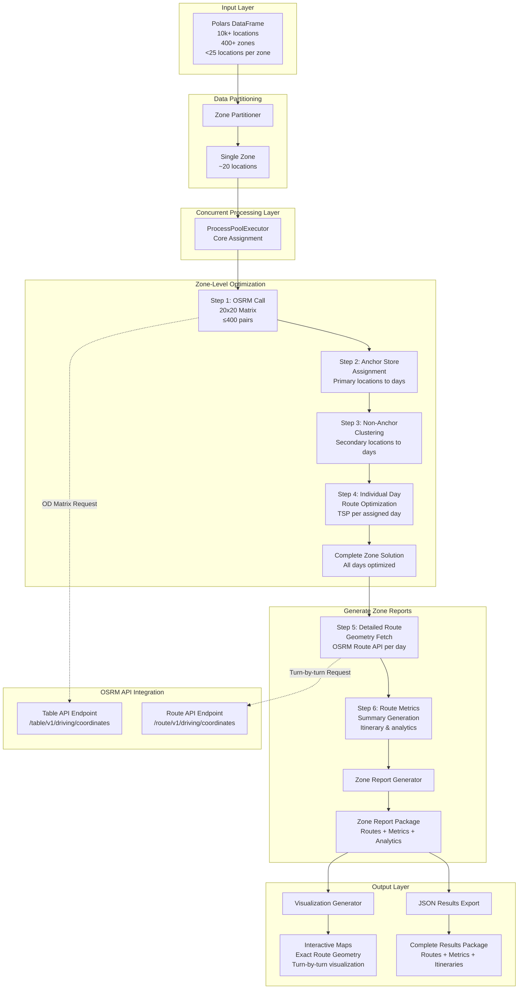
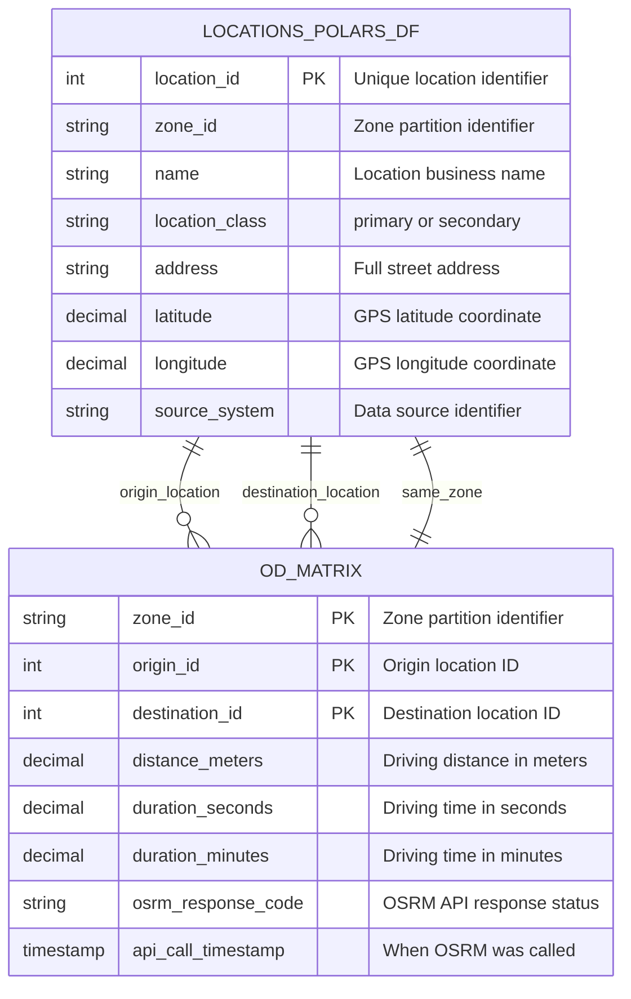
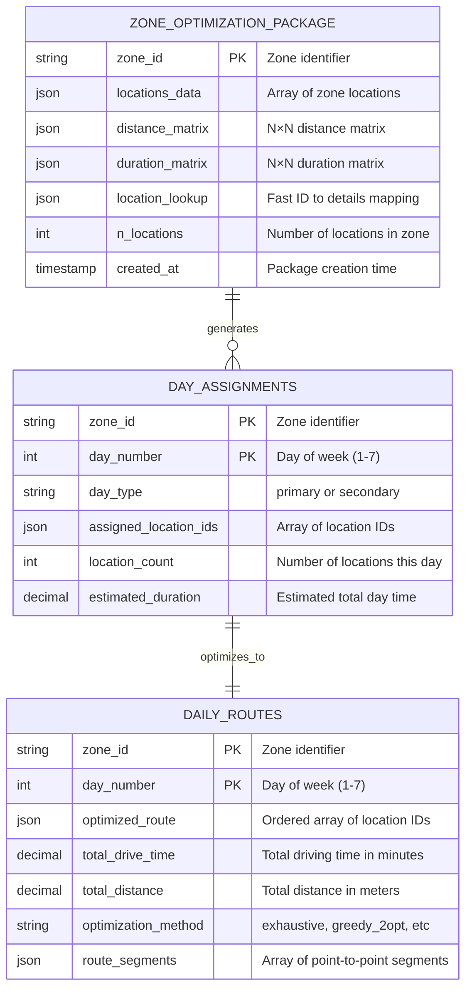

# Route Optimization

A Python project for optimizing delivery routes and solving vehicle routing problems (VRP).

## Installation

```bash
# Create virtual environment
uv venv

# Activate virtual environment
source .venv/bin/activate  # Linux/Mac
# or
.venv\Scripts\activate     # Windows

# Install dependencies
uv add -r requirements.txt
```

## Usage

```bash
# Run the main optimization algorithm
uv run main.py

# Run with specific parameters
uv run main.py --locations subway_locations.json --config config/model-params.yaml
```

## Configuration

Edit `config/model-params.yaml` to adjust optimization parameters:

- `days-per-week`: Working days per week
- `utilization`: Fleet utilization percentage
- `primary-hours-per-week`: Hours for primary locations
- `hours-per-non-primary`: Hours for secondary locations
- `locations-per-day-max`: Maximum locations per day
- `drive-inefficiency`: Routing inefficiency factor

## Development

```bash
# Install development dependencies
uv add --dev pytest black flake8 mypy

# Run tests
pytest

# Format code
black .

# Run linting
flake8

# Type checking
mypy .
```

## OSRM Routing API Integration

This project integrates with the OSRM (Open Source Routing Machine) server for real-world driving distances and route optimization.

### Base URL
```bash
# Kubernetes deployment (external access)
http://192.168.50.2:32050
```

### Key Endpoints for Route Optimization

#### 1. Table Service - Origin-Destination Matrix
**Endpoint**: `/table/v1/driving/{coordinates}`

Essential for generating distance/duration matrices between all location pairs.

```bash
# Distance/duration matrix for multiple points (SF, Oakland, San Jose)
curl "http://192.168.50.2:32050/table/v1/driving/-122.4194,37.7749;-122.2711,37.8044;-121.8863,37.3382"
# Returns: Full NxN origin-destination matrix of distances and durations

# Matrix with distance and duration annotations
curl "http://192.168.50.2:32050/table/v1/driving/-122.4194,37.7749;-122.2711,37.8044?annotations=distance,duration"
# Returns: Separate distance and duration arrays for analysis
```

#### 2. Trip Service - Traveling Salesman Optimization  
**Endpoint**: `/trip/v1/driving/{coordinates}`

Built-in TSP solver for optimal visit ordering.

```bash
# Trip optimization for multiple locations (finds optimal order)
curl "http://192.168.50.2:32050/trip/v1/driving/-122.4194,37.7749;-122.2711,37.8044;-121.8863,37.3382;-122.2585,37.8716"
# Returns: Optimized route visiting all points with minimal total distance

# Trip with fixed start and end points
curl "http://192.168.50.2:32050/trip/v1/driving/-122.4194,37.7749;-122.2711,37.8044;-121.8863,37.3382?source=first&destination=last"
# Returns: Optimized route starting at first point, ending at last point
```

#### 3. Route Service - Detailed Navigation
**Endpoint**: `/route/v1/driving/{coordinates}`

Detailed routing between specific points with turn-by-turn directions.

```bash
# Basic route between two points
curl "http://192.168.50.2:32050/route/v1/driving/-122.4194,37.7749;-122.2711,37.8044"
# Returns: Route geometry, duration, distance

# Route with turn-by-turn navigation steps
curl "http://192.168.50.2:32050/route/v1/driving/-122.4194,37.7749;-122.2711,37.8044?steps=true"
# Returns: Detailed turn-by-turn instructions

# Multi-waypoint route (SF → Oakland → San Jose)
curl "http://192.168.50.2:32050/route/v1/driving/-122.4194,37.7749;-122.2711,37.8044;-121.8863,37.3382"
# Returns: Route through multiple waypoints with leg-by-leg breakdown
```

### Common Parameters
- `overview`: Geometry overview (`full`, `simplified`, `false`)
- `steps`: Include turn-by-turn navigation (`true`, `false`) 
- `alternatives`: Return alternative routes (`true`, `false`)
- `annotations`: Additional metadata (`duration`, `distance`, `speed`)
- `geometries`: Response geometry format (`polyline`, `polyline6`, `geojson`)

### Response Format
All endpoints return JSON responses:
```json
{
  "code": "Ok",
  "routes": [...],
  "waypoints": [...]
}
```

### San Francisco Test Coordinates
- **San Francisco**: `-122.4194,37.7749`
- **Oakland**: `-122.2711,37.8044` 
- **San Jose**: `-121.8863,37.3382`
- **Berkeley**: `-122.2585,37.8716`

## Production Architecture

For production deployments with 10k+ locations distributed across zones (each zone containing <25 locations), the system uses a streamlined concurrent processing architecture optimized for small zone sizes.

### Architecture Overview



### Key Architecture Benefits

**1. Massively Simplified Algorithm per Zone**
- **No clustering needed**: <25 locations eliminates Stage 1 (day assignment)
- **Direct TSP solution**: Each zone becomes a single optimization problem
- **Exhaustive search feasible**: Brute force optimal for <8 locations, fast heuristics for 8-25
- **Single OSRM API call**: Each zone fits in one 25×25 table request (≤625 pairs)

**2. Extremely Efficient OSRM Integration**  
- **Perfect API fit**: 25×25 matrix = 625 pairs (well under OSRM limits)
- **Single call per zone**: No batching complexity needed
- **Concurrent API usage**: 400+ zones call OSRM simultaneously  
- **Rate limit friendly**: Natural parallelism distributes API load

**3. Performance Characteristics (Revised)**

| Dataset Size | Zones | Avg Zone Size | Processing Time | Memory Usage | OSRM Calls |
|--------------|-------|---------------|-----------------|-------------|------------|
| 1k locations | 50 zones | ~20 locations | **~5 seconds** | ~20MB | 50 calls |
| 10k locations | 500 zones | ~20 locations | **~30 seconds** | ~100MB | 500 calls |
| 100k locations | 5000 zones | ~20 locations | **~5 minutes** | ~500MB | 5000 calls |

**4. Simplified Zone Processing Flow**
```python
# Simplified production architecture for <25 locations per zone
def optimize_zone_simple(zone_df: pl.DataFrame) -> OptimizationResult:
    """Each zone is a simple TSP problem - no clustering needed!"""
    
    # 1. Single OSRM call for full OD matrix 
    coords = zone_df.select(['longitude', 'latitude'])
    coords_str = ';'.join([f"{row[0]},{row[1]}" for row in coords.iter_rows()])
    response = requests.get(f"http://192.168.50.2:32050/table/v1/driving/{coords_str}")
    od_matrix = parse_osrm_response(response.json())
    
    # 2. Direct TSP solution (no day assignment needed)
    if len(zone_df) <= 7:
        # Exhaustive search for optimal solution
        optimal_route = solve_tsp_exhaustive(od_matrix)
    else:
        # Fast heuristic for 8-25 locations  
        optimal_route = solve_tsp_greedy_2opt(od_matrix)
    
    return OptimizationResult(route=optimal_route, ...)

def optimize_production(locations_df: pl.DataFrame) -> Dict[str, OptimizationResult]:
    zone_groups = locations_df.group_by('zone_id')
    
    with ProcessPoolExecutor(max_workers=cpu_count()) as executor:
        zone_futures = {
            executor.submit(optimize_zone_simple, zone_df): zone_id
            for zone_id, zone_df in zone_groups
        }
        
        return {zone_futures[f]: f.result() for f in as_completed(zone_futures)}
```

**5. Major Algorithm Simplifications**
- **Skip Stage 1 entirely**: No hierarchical clustering needed
- **Skip day assignment logic**: Each zone = one optimization problem  
- **Skip cluster size constraints**: Never exceed 25 locations
- **Skip swap optimization**: TSP solution is already optimal for the zone
- **Use OSRM Trip API option**: Could even use built-in TSP solver per zone

## Data Flow ERD

### Stage 0: Data Ingestion

The system begins by ingesting location data from JSON files. For production, this extends to Polars DataFrames with zone partitioning.



### Current Data Structure (Development)
Based on `data/subway_locations.json`:

| Field | Type | Description | Example |
|-------|------|-------------|---------|
| `id` | int | Unique identifier | `1` |
| `name` | string | Business name | `"Subway - Folsom Street"` |
| `class` | string | Location type | `"primary"` or `"secondary"` |
| `address` | string | Street address | `"795 Folsom Street, San Francisco, CA 94107"` |
| `latitude` | decimal | GPS coordinate | `37.7821435` |
| `longitude` | decimal | GPS coordinate | `-122.4004926` |

### Production Data Structure (Planned)
For 10k+ locations with zone partitioning:

| Field | Type | Description | Example |
|-------|------|-------------|---------|
| `location_id` | int | Unique identifier | `1001` |
| `zone_id` | string | Zone partition | `"SF_DOWNTOWN_001"` |
| `name` | string | Business name | `"Subway - Market Street"` |
| `location_class` | string | Location type | `"primary"` or `"secondary"` |
| `address` | string | Street address | `"388 Market Street, SF, CA"` |
| `latitude` | decimal | GPS coordinate | `37.7908` |
| `longitude` | decimal | GPS coordinate | `-122.4010` |
| `source_system` | string | Data source | `"franchise_db"` or `"manual_entry"` |

### OD Matrix Structure
Generated from OSRM Table API calls - contains driving distances and times between all location pairs within each zone:

| Field | Type | Description | Example |
|-------|------|-------------|---------|
| `zone_id` | string | Zone partition (PK) | `"SF_DOWNTOWN_001"` |
| `origin_id` | int | Origin location ID (PK) | `1001` |
| `destination_id` | int | Destination location ID (PK) | `1002` |
| `distance_meters` | decimal | Driving distance | `1250.5` |
| `duration_seconds` | decimal | Driving time | `180.2` |
| `duration_minutes` | decimal | Driving time | `3.0` |
| `osrm_response_code` | string | API status | `"Ok"` |
| `api_call_timestamp` | timestamp | OSRM call time | `2024-01-15T10:35:22Z` |

**Key Characteristics:**
- **Zone-partitioned**: Each zone has its own complete OD matrix (≤625 pairs for <25 locations)  
- **Symmetric**: Distance from A→B equals B→A (bidirectional driving)
- **Complete**: Contains all N×N pairs within each zone
- **Single API call**: Entire zone matrix generated from one OSRM Table API request

### Post-OD Matrix Processing Structure

Once the OD matrix is generated, data is restructured for optimization algorithms within each thread:



### Data Structure Strategy

**Thread-Level Optimization Package:**
```python
class ZoneOptimizationPackage:
    zone_id: str
    locations: List[Location]  # Original location objects
    distance_matrix: np.ndarray  # N×N distances 
    duration_matrix: np.ndarray  # N×N durations
    location_lookup: Dict[int, Location]  # Fast access
    n_locations: int
```

**Why Combine at Thread Level:**
- **Algorithm efficiency**: Direct numpy array access for TSP algorithms
- **Memory locality**: All zone data in single object, better cache performance  
- **Simplified passing**: One object between optimization steps
- **Fast lookups**: Embedded location metadata eliminates joins

**Why Keep Separate in Storage:**
- **Reusability**: OD matrix can be cached and reused across optimization runs
- **Memory efficiency**: Don't duplicate location data in storage
- **Debugging**: Can inspect OD matrix independently
- **Versioning**: Can update optimization logic without regenerating OD matrices

## Project Structure

```
route-optimization/
├── config/
│   └── model-params.yaml    # Configuration parameters
├── data/
│   └── subway_locations.json # Location data
├── src/
│   ├── algorithms/          # Optimization algorithms
│   ├── models/             # Data models
│   └── utils/              # Utility functions
├── tests/                  # Test files
└── main.py                # Entry point
```