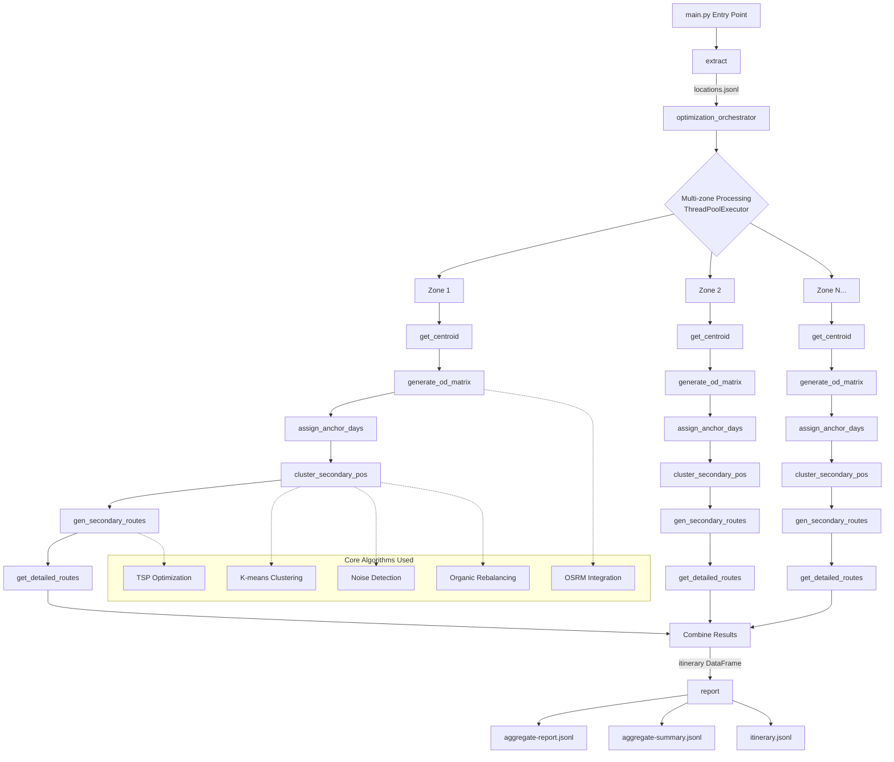

# route optimization with OSRM integration

A comprehensive Python-based route optimization system for solving vehicle routing problems (VRP) with real-world driving data. The system integrates with a local OSRM (Open Source Routing Machine) server for accurate distance matrices and turn-by-turn routing, supporting multi-threaded concurrent zone optimization with advanced TSP algorithms.

## Project structure

```
route-optimization/
├── main.py                           # Main entry point and CLI interface
├── CLAUDE.md                         # Project instructions for Claude Code  
├── README.md                         # Project documentation (this file)
├── methodology.md                    # Detailed algorithmic methodology and variations
├── pyproject.toml                    # Python project configuration (uv)
├── .gitignore                        # Git ignore patterns
├── config/
│   └── model-params.yaml             # Optimization parameters and settings
├── data/
│   └── locations.jsonl               # Location data with zone assignments (257 locations)
├── output/                           # Generated results (created at runtime)
│   ├── aggregate-report.jsonl        # Cross-zone detailed analytics
│   ├── aggregate-summary.jsonl       # Cross-zone summary statistics  
│   └── itinerary.jsonl               # Daily route itineraries
├── src/
│   ├── core/                         # Core optimization algorithms
│   │   ├── optimize.py               # Main optimization engine with K-means clustering
│   │   └── report.py                 # Comprehensive reporting and analytics
│   └── utils/                        # Utility and support modules
│       ├── clustering_utils.py       # K-means clustering with noise detection
│       ├── geo_utils.py              # Geographic utilities and distance calculations
│       ├── osrm_utils.py             # OSRM API integration (Table/Route APIs)
│       └── io_utils.py               # Data input/output utilities
├── streamlit/                        # Interactive web application
│   ├── app.py                        # Main Streamlit dashboard
│   ├── aggregate_report.py           # Aggregate reporting interface
│   ├── zone_details.py               # Individual zone analysis
│   └── utils.py                      # Streamlit utilities
├── tests/                            # Test suite
│   ├── test_main_optimizer.py        # Core optimization tests
│   ├── test_osrm.py                  # OSRM integration tests
│   ├── test_timeout.py               # Timeout handling tests
│   └── test_*.py                     # Additional test modules
├── .bak/                             # Backup of legacy pipeline stages
└── .dev/                             # Development utilities and format tests
```

### Key Files

**`main.py`**: Entry point supporting single-zone, multi-zone, clustering, and geocoding operations
**`src/core/optimize.py`**: Main optimization engine with K-means clustering and organic rebalancing
**`src/core/report.py`**: Comprehensive reporting, analytics, and visualization generation
**`src/utils/osrm_utils.py`**: OSRM integration for distance matrices and route geometry
**`src/utils/clustering_utils.py`**: K-means clustering with noise detection and duration rebalancing
**`streamlit/app.py`**: Interactive web dashboard for visualization and analysis
**`methodology.md`**: Complete algorithmic documentation with 8 variation analyses

## Installation

```bash
# Install dependencies using uv (recommended)
uv sync
```

## Quick Start

### Single Zone Optimization
```bash
# Optimize a specific zone
uv run python main.py zone_000

# View results
open output/visualizations/route_map_zone_000.html
```

### Multi-Zone Optimization  
```bash
# Optimize all zones concurrently
uv run python main.py

# Limit concurrent workers and zones
uv run python main.py --workers 4 --zones 10
```

### Location Management
```bash
# Re-cluster all locations with custom parameters
uv run python main.py --cluster --min 5 --max 20

# Fix coordinates via geocoding
uv run python main.py --geocode
```

### Configuration
The system uses `config/model-params.yaml` for optimization parameters:
- `primary_hours_per_location`: Hours spent at primary stores (default: 8.0)
- `secondary_hours_per_location`: Hours spent at secondary stores (default: 1.0) 
- `working_days_per_week`: Available working days (default: 5)
- `max_locations_per_day`: Maximum locations per day (default: 7)

## Development

```bash
# Run tests
uv run pytest tests/ -v

# Format code
uv run python -m black .

# Type checking  
uv run python -m mypy src/
```

## OSRM Integration

The system integrates with a local OSRM (Open Source Routing Machine) server for accurate real-world routing data. The server provides precise drive times, distances, and route geometries.

### Server Configuration
- **Base URL**: `http://192.168.50.2:32050`
- **Profile**: Driving profile with California road network
- **Coverage**: Optimized for California locations

### OSRM API Endpoints

**Table API** - Generate origin-destination matrices including zone centroid:
- Calculates all pairwise distances and durations
- Includes centroid (-1 ID) as potential starting point
- Returns symmetric matrix for TSP optimization

**Route API** - Fetch detailed route geometry:
- Provides encoded polyline for visualization
- Includes turn-by-turn instructions
- Used for final route presentation

## Performance Characteristics

### Multi-threaded Performance (Current Implementation)
- **Total Runtime**: ~6.36 seconds for 24 zones
- **Threading**: 12 worker threads (CPU count / 2)
- **Performance Gain**: 3.58x faster than sequential (72% reduction)
- **Locations**: 206 total (51 filtered for null zone_ids)
- **Optimization Quality**: 67% improvement in workload balance (std dev: 1.16)

### Sequential Baseline
- **Total Runtime**: ~22.76 seconds
- **Same optimization algorithms and API calls
- **Bottleneck**: Sequential OSRM API calls and optimization

## System Architecture

The route optimization system uses a multi-stage pipeline designed for concurrent multi-zone processing with OSRM integration.

### Architecture flow



### Processing Pipeline (6 Stages)

**Stage 0: Data Ingestion**
- Load locations from JSONL files
- Filter by zone ID
- Create zone optimization packages
- Validate coordinates and location data

**Stage 1: Day Assignment** 
- Assign primary locations to dedicated days (8 hours each)
- Use K-means clustering with noise detection for secondary locations
- Apply organic duration rebalancing to balance workloads
- Exclude isolated locations (>150km from neighbors)

**Stage 2: Route Optimization**
- Run adaptive TSP algorithms for each day's assigned locations
- Use exhaustive search for ≤5 locations, greedy+2-opt for larger sets
- Optimize for minimum total drive time per day

**Stage 4: Route Geometry**
- Fetch detailed route geometry from OSRM Route API
- Generate turn-by-turn instructions
- Calculate accurate drive times and distances

**Stage 5: Reporting**
- Generate comprehensive metrics and analytics
- Export detailed JSON reports with itineraries
- Calculate utilization and efficiency metrics

**Stage 6: Orchestration**
- Coordinate end-to-end pipeline execution  
- Handle concurrent multi-zone processing
- Generate visualization and export packages

### Multi-Zone Concurrent Processing

```python
def optimize_multiple_zones(zone_ids: List[str], max_workers: int = None):
    """Concurrent optimization across multiple zones."""
    
    with ProcessPoolExecutor(max_workers=max_workers or cpu_count()) as executor:
        # Submit all zone optimization tasks
        futures = {
            executor.submit(optimize_single_zone, zone_id): zone_id 
            for zone_id in zone_ids
        }
        
        # Collect results as they complete
        results = {}
        for future in as_completed(futures):
            zone_id = futures[future]
            try:
                results[zone_id] = future.result()
            except Exception as e:
                results[zone_id] = {'error': str(e)}
                
        return results
```

### Performance Characteristics

Current system performance with K-means clustering and organic rebalancing:

| Metric | Single Zone | Multi-Zone (24 zones) |
|--------|-------------|----------------------|
| **Locations** | ~8-12 locations | ~206 locations |
| **Processing Time** | ~0.1 seconds | ~6.4 seconds |
| **OSRM API Calls** | 2-3 calls | ~48-72 calls |
| **Memory Usage** | ~10MB | ~100MB |
| **Output Files** | 2 files | ~48 files |
| **Workload Balance** | N/A | 67% improved (std dev: 1.16) |

## Data Structures

### Input Data Format (JSONL)
Location data is stored in JSONL format with the following schema:

```json
{
  "id": 1,
  "name": "Subway - Granada Hills", 
  "address": "11878 Balboa Blvd, Granada Hills, CA",
  "latitude": 34.2776949,
  "longitude": -118.502159,
  "zone_id": "zone_000",
  "class": "primary"
}
```

| Field | Type | Description | Values |
|-------|------|-------------|---------|
| `id` | int | Unique location identifier | `1, 2, 3...` |
| `name` | string | Business name | `"Subway - Store Name"` |
| `address` | string | Full street address | `"123 Main St, City, CA"` |
| `latitude` | float | GPS latitude coordinate | `34.2776949` |
| `longitude` | float | GPS longitude coordinate | `-118.502159` |
| `zone_id` | string | Zone assignment | `"zone_000", "zone_001"...` |
| `class` | string | Location type | `"primary"` or `"secondary"` |

### Processing Data Structures

#### Zone Optimization Package
Internal data structure used during optimization:

```python
@dataclass
class ZoneOptimizationPackage:
    zone_id: str
    locations_df: pl.DataFrame      # Zone locations
    od_matrix: Dict[Tuple[int, int], float]  # Distance matrix
    primary_assignments: Dict[int, int]      # Primary locations → days
    secondary_assignments: Dict[int, List[int]]  # Days → secondary locations
    available_days: List[int]       # Working days for secondary locations
```

#### Output Structures

**Zone Report (JSON Export)**
```json
{
  "zone_id": "zone_000",
  "metrics_summary": {
    "total_locations_visited": 11,
    "total_drive_time_minutes": 165.9,
    "primary_store_count": 2,
    "non_primary_store_count": 9
  },
  "daily_itineraries": {
    "1": {
      "day": 1,
      "day_type": "primary",
      "locations": [{"location_id": 80, "name": "Subway - Granada Hills", ...}]
    }
  },
  "route_geometries": {
    "3": {
      "geometry_polyline": "encoded_polyline_string",
      "total_distance_meters": 42847.2,
      "total_duration_seconds": 2548.5,
      "turn_by_turn_instructions": [...]
    }
  }
}
```

**Visualization Data (HTML)**
- Interactive maps with route geometry
- Daily summary tables with metrics
- Detailed itineraries with time schedules
- Store classification badges (primary/secondary)

## Algorithm Evolution

This project has undergone systematic optimization through 8 major variations, achieving a **67% improvement in workload balance** through:

1. **K-means clustering**: Superior spatial optimization for geographic data
2. **Noise point detection**: Excludes isolated locations (>150km from neighbors)  
3. **Organic duration rebalancing**: Balances workloads using real business metrics
4. **Real drive time integration**: Accurate OSRM-based distance calculations

See `methodology.md` for detailed algorithmic analysis and variation performance comparisons.